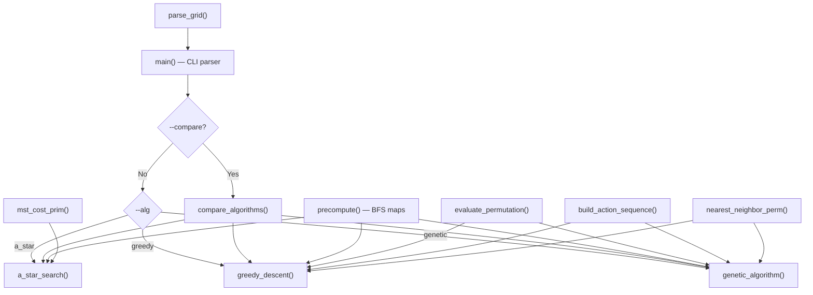

# Gold Hunter — Code Report & Walkthrough

## Overview

`goldhunter.py` is a single-file Python solution for a 6×6 grid-based gold collection planning problem. It implements **three AI algorithms** that find action sequences to collect all gold pieces and return to start, minimising total actions.

| Algorithm | Guarantee | Approach |
|---|---|---|
| A\* Search | **Optimal** | Informed graph search with admissible MST heuristic |
| Greedy Descent | Near-optimal | Steepest-descent hill climbing with random restarts |
| Genetic Algorithm | Good quality | Evolutionary optimisation (population-based) |

---

## Architecture



The code is organised into **10 sections** across ~695 lines:

| Section | Lines | Purpose |
|---|---|---|
| 1. Grid Parsing | 34–78 | Read 6×6 grid, locate start `S` and golds `G` |
| 2. BFS Utilities | 85–129 | `bfs_from()` and `reconstruct_actions()` |
| 3. Precomputation | 136–163 | BFS from every key position; build distance & path matrices |
| 4. MST | 170–209 | Prim's algorithm for heuristic computation |
| 5. A\* Search | 216–334 | Cell-level state-space search with MST heuristic |
| 6. Permutation Helpers | 341–401 | `evaluate_permutation()`, `build_action_sequence()`, nearest-neighbour |
| 7. Greedy Descent | 408–498 | Swap + 2-opt steepest descent with 30 restarts |
| 8. Genetic Algorithm | 505–614 | Tournament selection, OX crossover, swap mutation, elitism |
| 9. Comparison Mode | 621–636 | Run all three and print table |
| 10. Main | 643–688 | `argparse` CLI entry point |

---

## Algorithm Details

### 1. A\* Search (Section 5)

**State:** `(position, bitmask)` — position is `(row, col)`, bitmask tracks collected golds.

**State space size:** `36 × 2^n` where n = number of golds (max ~2304 for 6 golds).

**Heuristic:**

```
h(p, M) = MST({p} ∪ uncollected_golds ∪ {start}) + |uncollected|
```

- **MST component:** Lower-bounds movement cost. Any valid tour is a connected spanning subgraph, and MST ≤ any spanning connected subgraph.
- **|uncollected| component:** Exact grab cost (1 per gold).
- **Admissibility:** Both components are lower bounds ⟹ h ≤ h\* ⟹ admissible ⟹ A\* is optimal.

**Key implementation details:**
- BFS precomputed from all key positions for O(1) distance lookups
- Heuristic values cached in `h_cache` dictionary
- Counter-based tiebreaker in priority queue for FIFO ordering
- Path reconstructed via `came_from` parent pointers

---

### 2. Greedy Descent (Section 7)

**Solution representation:** Permutation of gold indices — visit order.

**Cost function:**
```
C(π) = Σ BFS_dist(waypoint_i, waypoint_i+1) + n_golds
```

**Neighbourhood operators:**
1. **Swap** — exchange two elements at positions i, j
2. **2-opt reversal** — reverse a contiguous subsequence

**Workflow:**
1. First restart: nearest-neighbour heuristic initialisation
2. Restarts 2–30: random permutation initialisation
3. Each restart: swap-based steepest descent → 2-opt steepest descent
4. Track global best across all restarts

**Determinism:** `random.seed(42)` for reproducibility.

---

### 3. Genetic Algorithm (Section 8)

**Chromosome:** Same permutation representation as Greedy Descent.

| Parameter | Value |
|---|---|
| Population size | 100 |
| Generations | 500 |
| Mutation rate | 0.15 |
| Elite count | 5 |
| Tournament size | 3 |

**Operators:**
- **Selection:** Tournament (pick 3 random, keep fittest)
- **Crossover:** Order Crossover (OX) — copies a segment from parent 1, fills rest from parent 2 preserving order
- **Mutation:** Swap mutation (exchange two random positions)
- **Elitism:** Top 5 carried over unchanged

**Initialisation:** 1 nearest-neighbour solution + 99 random permutations.

---

## Shared Infrastructure

### BFS Precomputation ([precompute()](file:///c:/Users/ziadb/Desktop/Curriculum/HIT,SZ/6th%20Semister/Artificial%20Intelligance/Final%20Project/goldhunter.py#L136-L163))

Runs BFS once from each key position (start + all golds). Returns:
- `bfs_maps` — full distance/predecessor maps (used by A\* heuristic for arbitrary cell lookups)
- `dist_matrix` — key-to-key distances (used by permutation algorithms)
- `path_matrix` — key-to-key action sequences (used to build final output)

### Permutation Evaluation ([evaluate_permutation()](file:///c:/Users/ziadb/Desktop/Curriculum/HIT,SZ/6th%20Semister/Artificial%20Intelligance/Final%20Project/goldhunter.py#L341-L361))

Shared by Greedy Descent and Genetic Algorithm. Sums BFS distances along the permutation route plus one grab per gold.

---

## CLI Usage

```bash
# Run individual algorithms
python goldhunter.py --alg a_star   --layout input.txt
python goldhunter.py --alg greedy   --layout input.txt
python goldhunter.py --alg genetic  --layout input.txt

# Compare all three
python goldhunter.py --compare      --layout input.txt
```

**Output format:**
```
<cost>
<space-separated actions>
```

If no solution exists: `-1` / `None`

---

## Test Results

All three algorithms were tested across 4 layouts of increasing difficulty:

| Test Case | Golds | Walls | A\* Cost | Greedy Cost | Genetic Cost |
|---|---|---|---|---|---|
| `test_easy` | 1 | 0 | **9** | 9 | 9 |
| `input` | 3 | 4 | **19** | 19 | 19 |
| `test_hard` | 5 | 4 | **23** | 23 | 23 |
| `test_complex` | 6 | 4 | **24** | 24 | 24 |

**Timing (seconds):**

| Test Case | A\* | Greedy | Genetic |
|---|---|---|---|
| `test_easy` | 0.0003 | 0.0000 | 0.2697 |
| `input` | 0.0012 | 0.0007 | 0.3918 |
| `test_hard` | 0.0016 | 0.0025 | 0.4308 |
| `test_complex` | 0.0013 | 0.0042 | 0.4479 |

> [!NOTE]
> All three algorithms found the optimal cost on every test case. A\* guarantees optimality; Greedy and Genetic happened to match it due to the small problem size (≤6 golds).

---

## File Inventory

| File | Purpose |
|---|---|
| [goldhunter.py](file:///c:/Users/ziadb/Desktop/Curriculum/HIT,SZ/6th%20Semister/Artificial%20Intelligance/Final%20Project/goldhunter.py) | Main implementation (all 3 algorithms) |
| [input.txt](file:///c:/Users/ziadb/Desktop/Curriculum/HIT,SZ/6th%20Semister/Artificial%20Intelligance/Final%20Project/input.txt) | Example grid (3 golds, 4 walls) |
| [test_easy.txt](file:///c:/Users/ziadb/Desktop/Curriculum/HIT,SZ/6th%20Semister/Artificial%20Intelligance/Final%20Project/test_easy.txt) | 1 gold, no walls |
| [test_hard.txt](file:///c:/Users/ziadb/Desktop/Curriculum/HIT,SZ/6th%20Semister/Artificial%20Intelligance/Final%20Project/test_hard.txt) | 5 golds, 4 walls |
| [test_complex.txt](file:///c:/Users/ziadb/Desktop/Curriculum/HIT,SZ/6th%20Semister/Artificial%20Intelligance/Final%20Project/test_complex.txt) | 6 golds, 4 walls |
| [generate_plots.py](file:///c:/Users/ziadb/Desktop/Curriculum/HIT,SZ/6th%20Semister/Artificial%20Intelligance/Final%20Project/generate_plots.py) | Benchmarking + matplotlib charts |
| [report.tex](file:///c:/Users/ziadb/Desktop/Curriculum/HIT,SZ/6th%20Semister/Artificial%20Intelligance/Final%20Project/report.tex) | LaTeX report source |
| [report.pdf](file:///c:/Users/ziadb/Desktop/Curriculum/HIT,SZ/6th%20Semister/Artificial%20Intelligance/Final%20Project/report.pdf) | Compiled PDF report |
| [GoldHunter_Submission.zip](file:///c:/Users/ziadb/Desktop/Curriculum/HIT,SZ/6th%20Semister/Artificial%20Intelligance/Final%20Project/GoldHunter_Submission.zip) | Submission package (goldhunter.py + report.pdf) |
